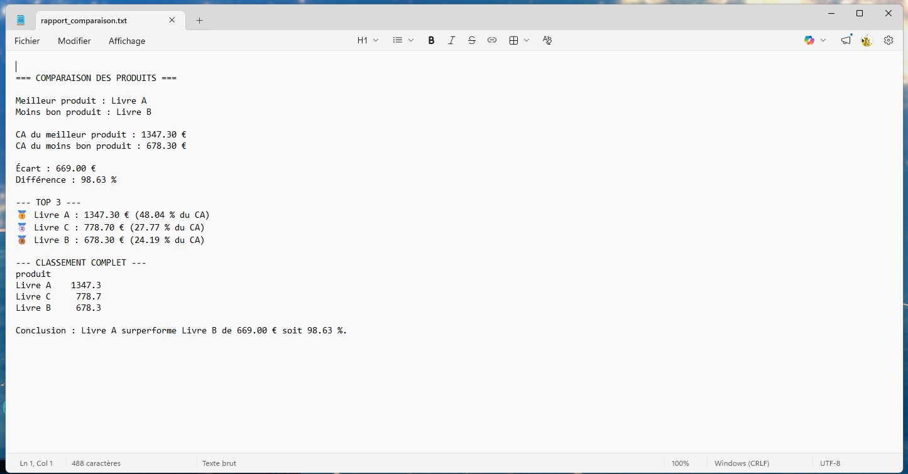
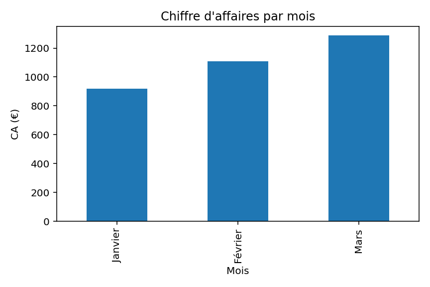
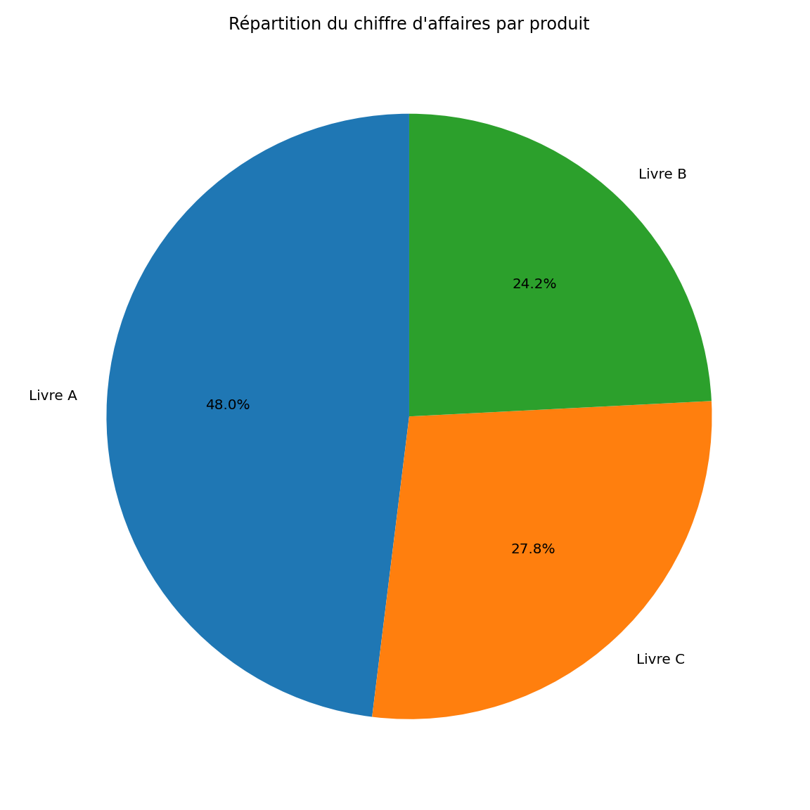

📊 Comparateur de performance produits


Outil Python permettant d’analyser et comparer les performances de plusieurs produits à partir d’un fichier CSV de ventes.

---

🎯 Objectif

Cet outil permet de répondre rapidement à des questions clés :

- Quel produit génère le plus de chiffre d’affaires ?
- Quel est le moins performant ?
- Quel est l’écart entre les deux ?
- Quelle est la répartition du CA entre les produits ?



---

⚙️ Fonctionnalités

- 📈 Calcul automatique du chiffre d’affaires  
- 🏆 Classement complet des produits  
- 🥇🥈🥉 Top 3 avec médailles  
- 🔍 Identification du meilleur et du moins bon produit  
- 📊 Comparaison avec écart en € et en %  
- 📝 Génération d’un rapport texte  
- 📁 Export des résultats en CSV  
- 📊 Visualisations :
- Camembert (répartition du CA)
- Bar chart premium (classement visuel)





---

📂 Format du fichier d’entrée

Le fichier CSV doit contenir au minimum :

```csv
produit,ventes,prix
Livre A,120,4.99
Livre B,80,3.99
